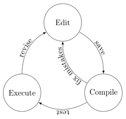

## Introduction
These exercises are an introduction to C programming in a Unix environment.

Two guides to C are

[The C Book](assets/ra/thecbook.pdf)
: A thorough guide to C, it takes you through all the important features.

[Essential C](assets/ra/EssentialC.pdf)
: A shorter summary of C

## Tools

__A good text editor__
C programs are just text, so any good programmer's text editor will do.  I
happen to use `vi`/`vim` since I am familiar with it from long use.
Other editors will do, some people find `nano` is slightly more friendly
to new users.  Editors written for programming tend to have syntax
highlighting and support for navigating through the code, these are helpful
but not essential.

__A C compiler__
Translates the C program into executable instructions
for the target processor.  On \unix\ systems there is usually a `cc`
compiler, most likely a symbolic link to `gcc`

__Terminal/shell__
I tend to have at least two terminals with shell
sessions running.  One in which I have the editor, another where I run the
compiler, and others as needed to read documentation.

__Version control__
Programs are text and so are easy to manage with version control systems (such
as `git`), its good practice so get into the habit of using version
control on your code.

## Creating a C program
Writing a program in C on UNIX systems goes through a familiar cycle.
__Edit__ the code, _save_ the changes, __Compile__ the program
and _fix errors_ that occur at compilation stage.  Then _test_ the
program by __Executing__ it, and revise the program in the light of test
results.



__Editing__ is done in the editor.
```shell-session
$ vi hello.c
$ nano hello.c
```

__Compiling__ is done with the Gnu C Compiler (`gcc`) or
the default C compiler (`cc`).  The command line option `-o` sets the
output filename to `hello` in this case.
```shell-session
$ cc -o hello  hello.c
$ gcc -o hello  hello.c
```

__To Execute__ the program, use the name of the file it is compiled
into as the command.  Depending on how the `PATH` variable is set you may
have to use a `./` prefix.
```shell-session
$ hello
$ ./hello
```

## Exercises

### hello world
  Try the "hello world" program.
```c
#include <stdio.h>

int main ( int argc, char *argv[] )
{
	printf("Hello world\n");
}
```
A shell terminal session would look like.
```shell-session
$ vi hello.c
$ cc -o hello hello.c
$ ./hello
Hello World
$
```

### if statements
1. The government sets a tax called "_stamp duty_" on house sales.
   For houses up to £60000 there is no duty, for houses over
   £60000 up to £250000 the duty is levelled at 1%, over
   £250000 up to £500000 the duty is at 3%, over £500000 the rate is set at
   4%.  Write a program to input a price (in
   integer pounds) and output the stamp duty to be paid (ignoring any
   pence).
	[[sample
solution](https://gist.github.com/dr-alun-moon/4b3bbe345fc6352d4ec77564fe4e2446)]

   >  What is the difference between calculating the duty using
   >  `price*0.03` and `price*3/100` ?
	
	> > `price*0.03` returns a `double` as the type, whereas  
    > > `price*3/100` uses integer arithmetic and is an `int` type
	{: .class answer }

2. Exam grades are given a letter A--F.  Write a program that reads
  in a mark, and prints out the grade.  An A is given for marks at least
  80%, B for marks at least 70%, C 60%, D 50%, E 40%, and F for
  below 40%.
	[[sample
solution](https://gist.github.com/dr-alun-moon/14e9449ca31ae14459970e5e736f4ca8)]

### Loops
1. Write a program that prints out a list of diameters and the circumference
   and area of the circle.  You will want a `for` loop, you can write
   expressions for the calculations or use functions.  If you want  a detailed
   explanation of `printf`, try the command `man -s3 printf` in a terminal.
	[[sample
solution](https://gist.github.com/dr-alun-moon/fd7110a4b50f95ae0c6461b221abed3e)]
2. Write a program that prints out a set of Fibonacci numbers.  You may want a
   `while` loop in this case.  Try out printing _n_ numbers, and numbers less
   than _h_.
	[[sample
solution](https://gist.github.com/dr-alun-moon/8c608a4dc47daf638c9e06295ace6912)]
3. The following program prints out the 7 times table.
   The field description `%2i` means print an integer in a space two
   characters wide, filling with spaces if the number uses less than two
   characters.

   > ```c
   > #include <stdio.h>
   > 
   > main()
   > {
   >   int a;
   >   for(a=1 ; a<=10 ; ++a)
   >     printf("%2i x 7 = %2i\n",  a, a*7);
   > }
   > ```

   Modify the program to input a number and prints out the
   corresponding multiplication table.  Include a check to make sure
   the input value is between 1 and 10. [[sample
solution](https://gist.github.com/dr-alun-moon/f3f84c1dc3ccb0dadf36b4e8ebf99d24)]

4. The function `random()` in the stdlib library (use
   `#include <stdlib.h>`) returns a pseudo-random
   number (A seemingly random number, but the same sequence is
   generated each time the program is run.)
   The `%` operator
   can be used to generate a random number in a given range.  So to
   generate random numbers between 0 and 100 use `random() % 100`.

   Write a program to simulate throwing a dice 10 times.  Run the
   program several times to confirm that the pseudo-random sequence is
   always the same. [[sample
solution](https://gist.github.com/dr-alun-moon/7b4406ceb04de7fb3070a12f7de4d76d)]

   How would you modify the program to specify the number of times to
   roll the dice, and the range of numbers to generate (0...20, 1...6, _etc_).
   
5. Study my version of the statistics program (statistics.c)

      ```c
      #include <stdio.h>
      #include <math.h>
      
      /* read numbers from standard input into the
         array given as a paramater.
         returns: the number of items read.
      */
      int readdata(double *d) {
          int i=0;
          while (scanf("%lf",d++)!=EOF) {
              i++;
          }
          return i;
      }
      
      /* calculates the mean of the set of 'N'
         given numbers.
      */
      double mean(double* d, int N) {
          int i;
          double sum =0.0;
          for (i=0 ; i<N ; i++) {
              sum += d[i];
          }
          return sum/N;
      }
      
      /* calculates the standard deviation of a set
         of 'N' numbers with a mean 'm'.
      */
      double stddev(double *d, double m, int N) {
          int i;
          double sum;
          for ( i=0 ; i<N ; i++) {
              double diff = d[i]-m;
              sum += diff*diff;
          }
          return sqrt(sum/N);
      }
      
      int main() {
          int N;
          double m,s;
          const int maxdata=32768 ; /* 32K
      				 numbers */
          double data[maxdata];
      
          N = readdata(data);
          m = mean(data,N);
          s = stddev(data, m,N);
      
          printf("mean   %lf \nstddev %lf\n", m, s);
      }
      ```

     * add a function `int max(int data[], int N);` that finds the maximum value.
	 * add a function `int min(int data[], int N);` that finds the minimum value.
     * add a function that finds the mode (most frequent value).  You will need a bigger frequency table `int occurrence[101];`

