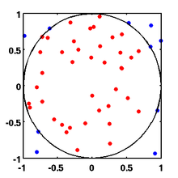

# Introduction

This lab looks at
the problems that can arise when threads share resources and how to
achieve a speedup in execution time with multi-threaded programs on
a computer with more than one processor. You will
practice:
* how to write `main.c` to create threads and execute them
* how to suspend threads by using delays
* how to identify interference problems when
threads share resources
* how to protect a critical section using Peterson's algorithm
* how to develop a multi-threaded program for a multi-processor computer and
how to measure the speedup that it delivers

# In the lab

1. Clone the `git` repository for this lab by executing the following
command at the command terminal:

   ``` shell_session
   $ git clone https://github.com/DavidKendall/kf5010_L06
   $ cd kf5010_L06
   ```
Build and run the `count_unprotected` program as follows:

   ``` shell_session
   $ gcc -Wall -c console_safe.c
   $ gcc -Wall -o count_unprotected -pthread count_unprotected.c console_safe.o -lncursesw
   $ ./count_unprotected
   ```
Run the program 10 times. Observe its behaviour. What do you notice? Is the program behaving as you
would expect? If not, describe the problem. What do you think is
causing the behaviour that you see?

1. Now build and run the `count_peterson` program as follows:

   ``` shell_session
   $ gcc -Wall -o count_peterson -pthread count_peterson.c console_safe.o -lncursesw
   $ ./count_peterson
   ```
This is an attempt to fix the problem exhibited
by the previous program. Observe the behaviour of the new program.
What do you notice this time?

1. Carefully study the code of both `count_unprotected.c` and `count_peterson.c`.
Write down all the differences that you notice. Explain why `count_peterson` works
correctly.

1. Modify `count_peterson` so that the call to `lcd_write_at()` is *outside* the
critical section, i.e. so that it appears immediately after `need1 = false` in
`count1_thr` and immediately after `need2 = false` in `count2_thr`. Build and run
the program again. Run it several times. Observe what happens. You should see that
the program runs without problems.

1. `lcd_write_at()` just positions the cursor and then writes a string. It should
be the same as first calling `lcd_set_pos()` and then calling `lcd_write()`.
Modify your program to make these substitutions in both `count1_thr` and
`count2_thr`. Build and run the program again. Observe what happens. Probably
the lcd display is a bit mixed up. Why is this? What race condition is being
observed here?

1. Now modify the program so that the calls to `lcd_set_pos()` and
`lcd_write()` appear *inside* the critical section, i.e. immediately before
the lines that set the `need` variables to `false` in each of `count1_thr` and
`count2_thr`. Build and run the program again. Observe what happens. Why does
your program work properly again now? It's important that you should be clear
about why your programs behave as they do in the last 3 exercises. If there's
anything that you're not clear about, discuss it with your lab tutor.

1. When you run a multi-threaded program on a computer with more than one
processor, it is possible that some of those threads will execute
*simultaneously* and so the total execution time for the program may be less
than when you run the program on a machine with only one processor. The
remaining exercises explore this phenomenon. Firstly, we'll consider
a program where it is very easy to divide up the work of the program into
equal parts and to give each part to a separate thread. The final result of
the program is computed by combining the results from each of the threads.
We'll compare the execution time of a sequential version of the program with the
execution time of a multi-threaded version and introduce the idea of
*speedup*. The program that we consider is a Monte Carlo simulation for the
estimation of $$\pi$$. <br/> <br/> Look at the diagram below.

It shows a circle of radius $$r$$, where $$r = 1$$, inscribed inside a square
with sides of length $$2r$$. Let $$A_s$$ denote the area of the square and
$$A_c$$ denote the area of the circle. Then,
$$A_s = (2r)^2 = 4r^2$$ and $$A_c = \pi r^2$$. So, the ratio of
the area of the circle to the area of the square is given by:
\\[\frac{A_c}{A_s} = \frac{\pi r^2}{4r^2}\\]
and, therefore,
\\[\pi = 4 \cdot \frac{A_c}{A_s}\\]
Now imagine that the circle is a dartboard and that we throw darts at it
randomly, only ensuring that we never miss the square. Let $$N_t$$ be the total
number of darts that we throw and $$N_h$$ be the number of darts that hit the
dartboard. Assuming that we're equally likely to hit any point in the square,
we expect that, if we throw enough darts, then
\\[\frac{N_h}{N_t} \approx \frac{A_c}{A_s}\\]
and, therefore,
\\[\pi \approx 4 \cdot \frac{N_h}{N_t}\\]
We simulate throwing a dart by choosing two random numbers, $$(x, y)$$, in
the range $$-1$$ to $$1$$. These numbers represent the coordinates of the
point in the square that the dart hits. We do this repeatedly, counting
up the total number of darts thrown and the number of darts that hit the
dartboard. We then estimate the value of $$\pi$$ using the equation above.
<br/><br/>
This is not an efficient method of calculating $$\pi$$ but it is very easy
to implement as a multi-threaded program.
<br/><br/>
Checkout `P07` and have a look at `pi.c`. This is a single-threaded program that
implements the approach described above. Build and run the program. It may
take a minute or two to produce a result. Eventually it will show you an
estimate for the value of $$\pi$$ and an indication of how long it has
taken to compute it (given in microseconds). You'll need the
following commands:

   ``` shell_session
   $ git checkout P07
   $ gcc -o pi -pthread pi.c console_safe.o -lncursesw
   $ ./pi
   ```

1. Once you understand `pi.c` in its single-threaded form, you should attempt
to convert it to a multi-threaded program. Follow the structure of the
single-threaded program as closely as possible. The basic idea is to divide up
the work of "throwing the darts" equally between your threads. For example,
if your program simulates throwing 3000000 darts and you have 3 threads,
you should arrange for each thread to simulate throwing 1000000 darts and
then combine the results.

1. Once you are satisfied that you have a working multi-threaded program, you
should compare its performance with the single-threaded version. The usual
way to compare performance between a single-threaded program and a multi-threaded
program is to calculate the *speedup*. Assume that the execution time of the
single-threaded program is $$T_S$$ and the execution time of the multi-threaded
(parallel) program is $$T_P$$, then the speedup, $$S$$ is given simply by
\\[S = \frac{T_S}{T_P}\\]
If the speedup, $$S$$, approaches the number of threads, $$N$$, then your program
is said to achieve nearly *linear* speedup. In practice, it is very difficult
to achieve linear speedup, since there is usually some fraction of your program
that it is not possible to parallelise in any reasonable way. Note you will only
achieve speedup if you are running your program on a computer with multiple
processors. In a Linux environment, you can find out information about
your processors by examining the system file `/proc/cpuinfo`, e.g.

   ``` shell_session
   $ cat /proc/cpuinfo | less
   ```
to look in detail at your system's processor details, or

   ``` shell_session
   $ cat /proc/cpuinfo | grep processor | wc -l
   ```
simply to count the number of processors available on your system.
You should find out how many processors there are on your system and, assuming
this number is greater than 1, experiment with your multi-threaded program
by varying the number of threads used and the number of darts thrown in the
simulation. For example, on a computer with 4 processors, you could
measure the execution time for 2, 3, and 4 threads when simulating
throwing $$N \cdot 10^6$$, $$N \cdot 10^7$$, $$N \cdot 10^8$$, and
$$N \cdot 10^9$$ darts, where $$N$$ is the number of threads. Measure the
execution time of the single-threaded program for the same number of darts
as each of the multi-threaded cases and calculate the speedup in each case.
Note your observations carefully.
